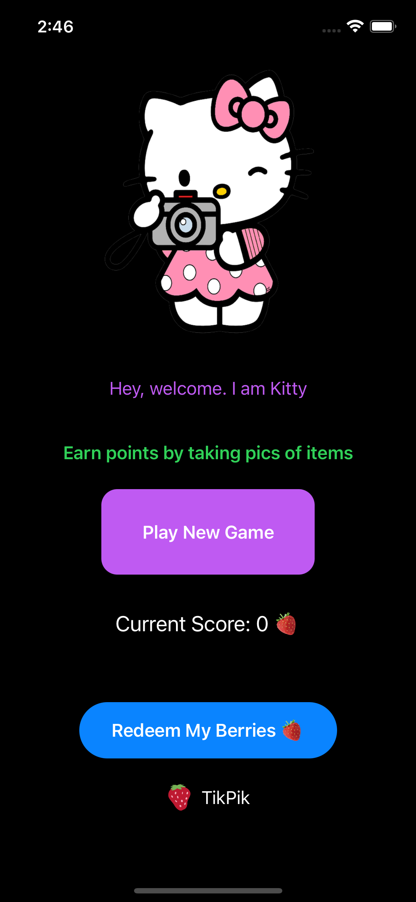
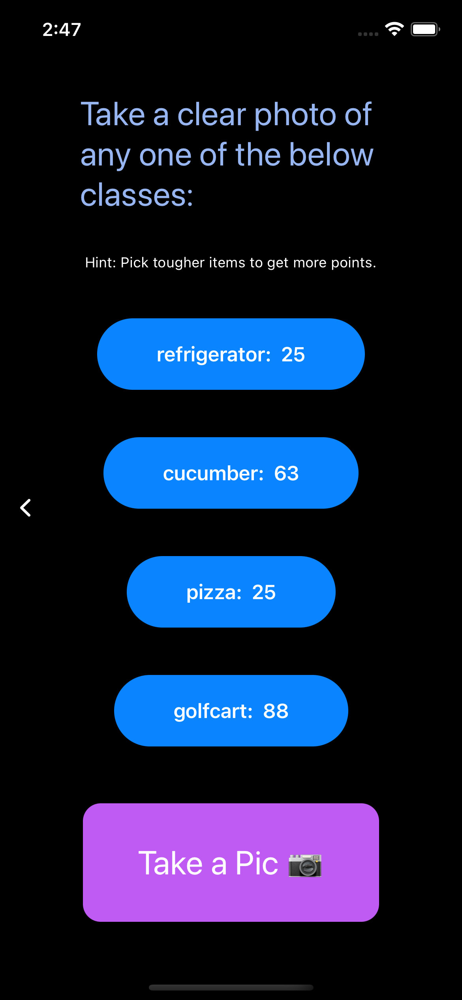
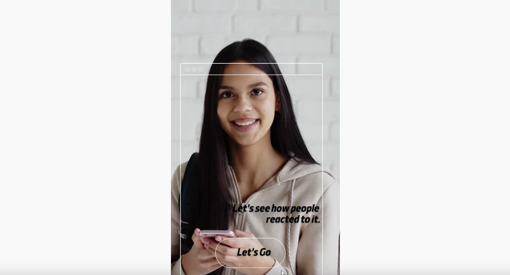

# tikpik-mobile-game
An IOS mobile game where you take photos of the labels that you have been asked to. 

<!-- PROJECT SHIELDS -->
<!--
*** I'm using markdown "reference style" links for readability.
*** Reference links are enclosed in brackets [ ] instead of parentheses ( ).
*** See the bottom of this document for the declaration of the reference variables
*** for contributors-url, forks-url, etc. This is an optional, concise syntax you may use.
*** https://www.markdownguide.org/basic-syntax/#reference-style-links
-->

[![LinkedIn][linkedin-shield]][linkedin-url]

<!-- ABOUT THE PROJECT -->
## About The Project

 

Tikpik was started with the idea of making data set collection for companies a bit cheaper and making a game out of it so that users can have fun, redeem points, and offers.  The app uses ML Model to identify and match the photos taken by the users and if correct, users are awarded accordingly. 

Here are some key features:
* Existing Database of labels (real life objects) which a users is supposed to select and a take a photo
* Take a photo from the camera from the app
* Uses Core ML MobileNet Model to classify the images. - Identify is a photo submitted for category 'apple' is an apple or not 

Here's the marketing explanation video:

(<a href="#top">back to top</a>)

### Built With

* [Swift UI](https://developer.apple.com/xcode/swiftui/)
* [Core Swift](https://developer.apple.com/swift/)
* [Core ML - MobileNet](https://developer.apple.com/documentation/coreml)

(<a href="#top">back to top</a>)

<!-- GETTING STARTED -->
## Getting Started

### Prerequisites

You will be required to have an IOS Device with Xcode installed to run the app in the environment.

### Installation

1. Download the repo into the folder.
2. Open the Folder in Xcode --> xcodeproject file 
3. As the app uses camera -> plug in a ios device for debugging
4. Click on Build and Run

(<a href="#top">back to top</a>)

<!-- USAGE EXAMPLES -->
## Usage

Once you run the app, and submit the photo that you have taken from the app.
The mobile net decides whether it is a correct image or not.

(<a href="#top">back to top</a>)

## Contributing

Contributions are what make the open source community such an amazing place to learn, inspire, and create. Any contributions you make are **greatly appreciated**.

If you have a suggestion that would make this better, please fork the repo and create a pull request. You can also simply open an issue with the tag "enhancement".
Don't forget to give the project a star! Thanks again!

1. Fork the Project
2. Create your Feature Branch (`git checkout -b feature/AmazingFeature`)
3. Commit your Changes (`git commit -m 'Add some AmazingFeature'`)
4. Push to the Branch (`git push origin feature/AmazingFeature`)
5. Open a Pull Request

(<a href="#top">back to top</a>)

<!-- LICENSE -->
## License
Distributed under the MIT License. See `LICENSE.txt` for more information.

(<a href="#top">back to top</a>)

<!-- CONTACT -->
## Contact

Name: [@jaydev13](https://twitter.com/jaydev13) - jay@snoolink.me

Project Link: [https://github.com/neuronjay](https://github.com/neuronjay)

(<a href="#top">back to top</a>)

<!-- ACKNOWLEDGMENTS -->
## Acknowledgments

Use this space to list resources you find helpful and would like to give credit to. I've included a few of my favorites to kick things off!

* [ReadMe Template]([https://choosealicense.com](https://github.com/othneildrew/Best-README-Template))
* [Malven's Flexbox Cheatsheet](https://flexbox.malven.co/)
* [Malven's Grid Cheatsheet](https://grid.malven.co/)
* [Img Shields](https://shields.io)
* [GitHub Pages](https://pages.github.com)
* [Font Awesome](https://fontawesome.com)

(<a href="#top">back to top</a>)

<!-- MARKDOWN LINKS & IMAGES -->
<!-- https://www.markdownguide.org/basic-syntax/#reference-style-links -->
[linkedin-shield]: https://img.shields.io/badge/-LinkedIn-black.svg?style=for-the-badge&logo=linkedin&colorB=555
[linkedin-url]: https://linkedin.com/in/jaydev13
[product-screenshot1]: images/screenshot1.png
[product-screenshot2]: images/screenshot2.png
[product-screenshot3]: images/screenshot3.png
